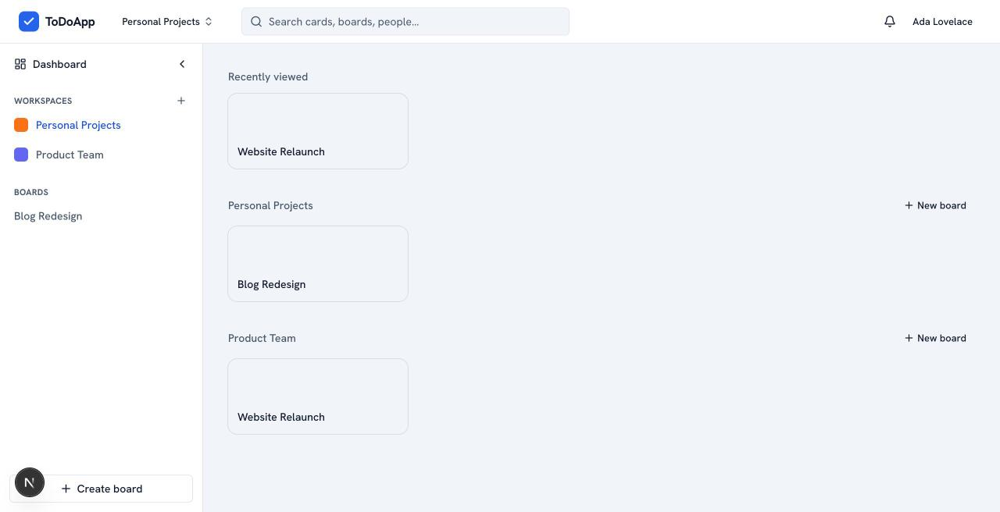
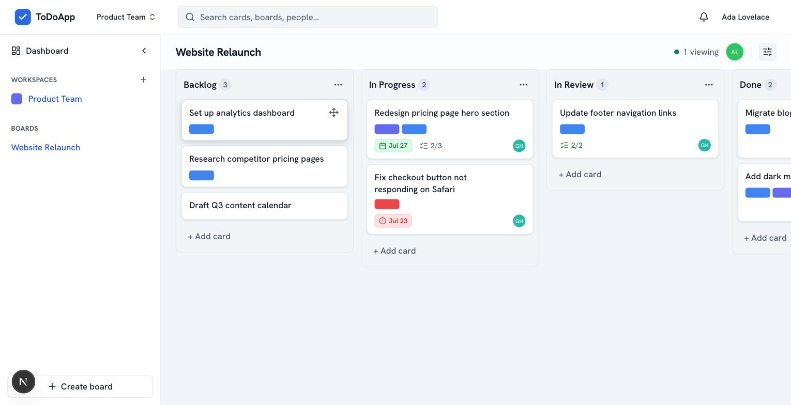
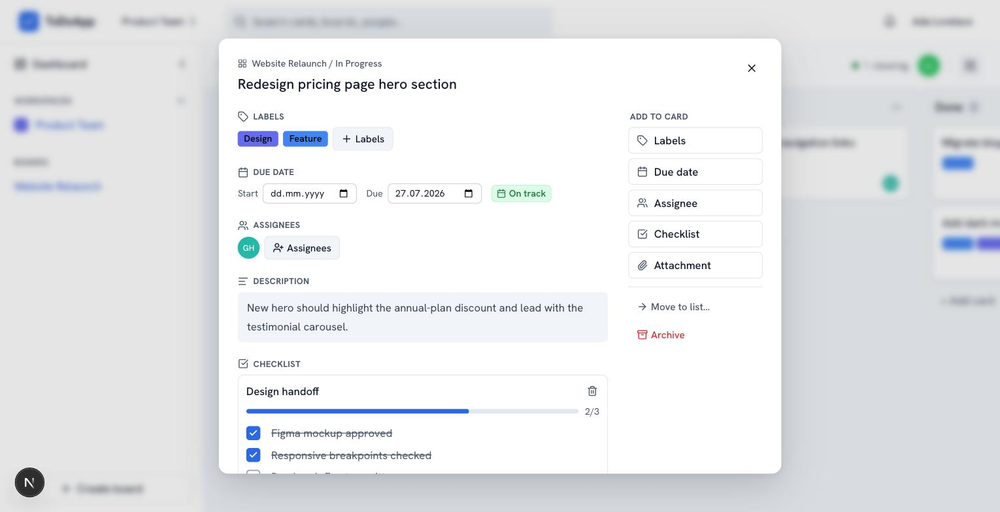
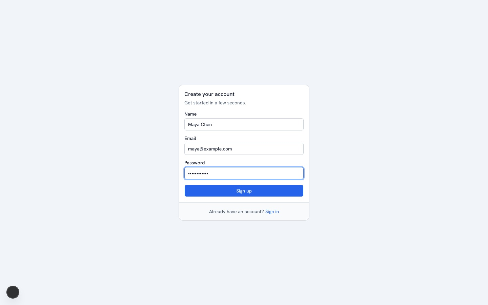
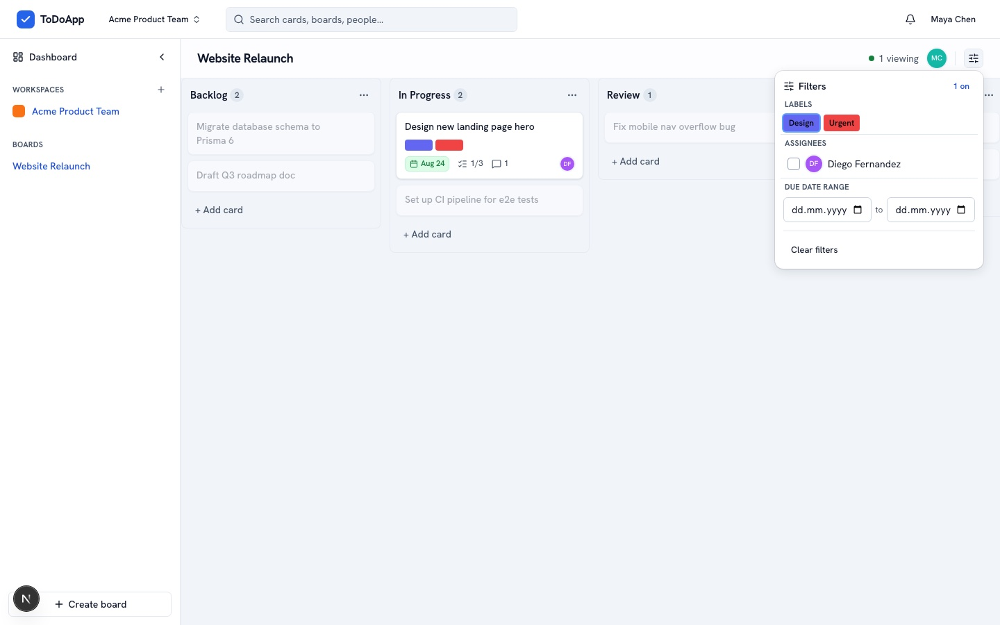
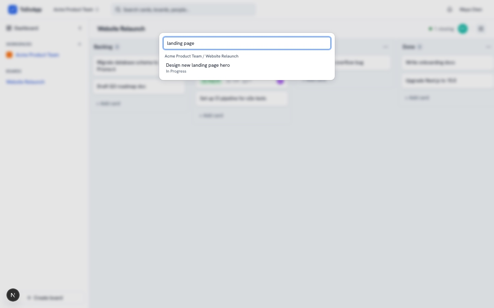
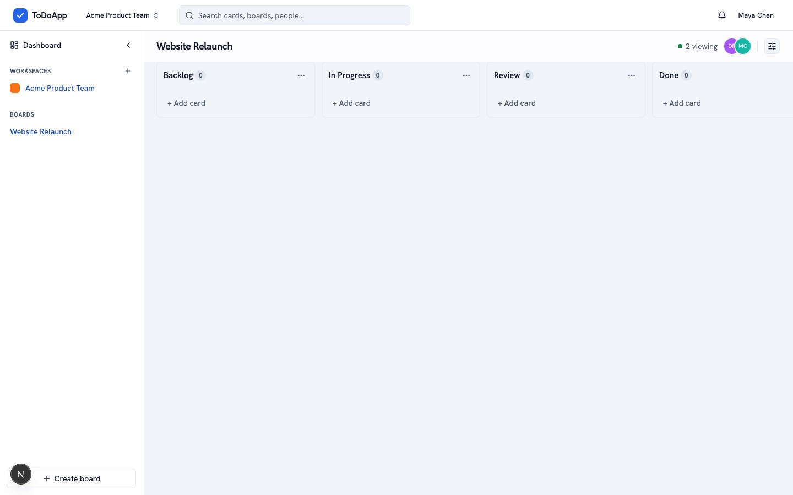
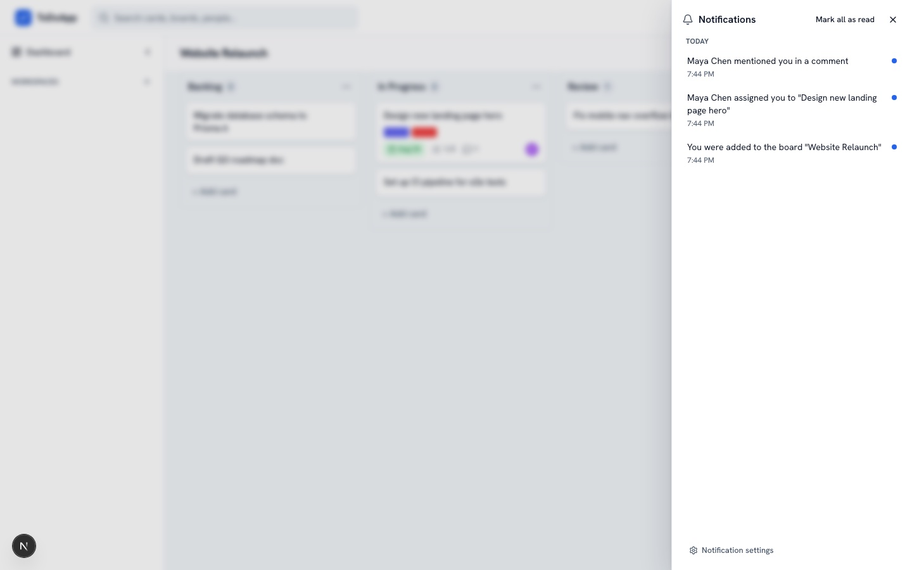
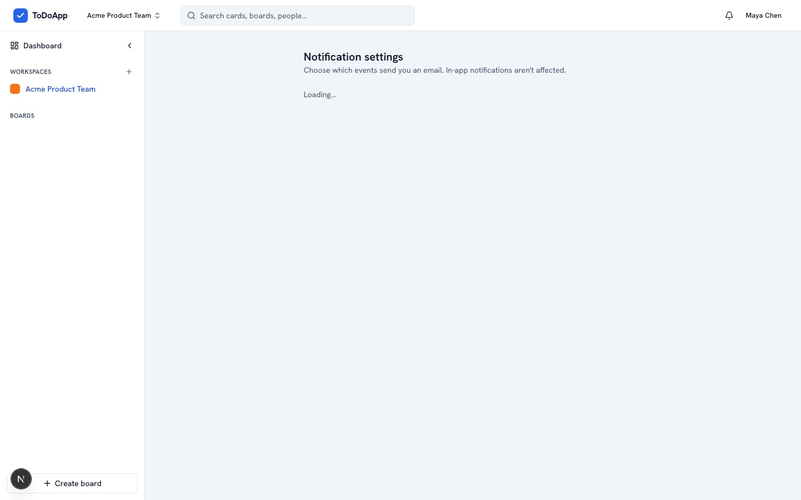
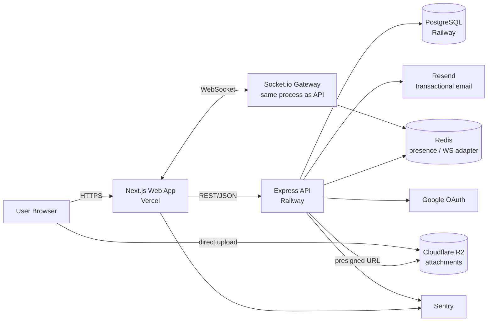

# ToDoApp — Trello-Style Collaborative Task Board

A full-stack, real-time collaborative task board (Workspaces → Boards → Lists → Cards) built as a
portfolio-grade showcase of production-quality engineering: server-authoritative permissions,
WebSocket-based live collaboration, optimistic-UI with conflict handling, and a tested, observable,
typed-end-to-end codebase.

> **Status:** Feature-complete (Epics 1–7 and the majority of Epic 8 done — see [Project status](#project-status)).
> This project is built and packaged to run locally — see [Getting started](#getting-started); it is
> not deployed to a public URL.

| Dashboard | Board view | Card detail |
|---|---|---|
|  |  |  |

## Table of contents

- [Features](#features)
- [Feature gallery](#feature-gallery)
- [Architecture](#architecture)
- [Tech stack](#tech-stack)
- [Repository layout](#repository-layout)
- [Getting started](#getting-started)
- [Testing](#testing)
- [Engineering highlights](#engineering-highlights)
- [Project status](#project-status)
- [Planning documents](#planning-documents)

## Features

- **Auth**: email/password (argon2, rotating refresh tokens with reuse detection) + Google OAuth,
  password reset, profile with avatar.
- **Workspaces & Boards**: multi-tenant workspaces, board membership with Admin/Member/Viewer roles,
  archive/restore/delete, custom backgrounds.
- **Lists & Cards**: drag-and-drop reordering within and across lists (pointer + full keyboard
  alternative), archive/restore, quick-add.
- **Card detail**: markdown description, labels, due/start dates with overdue flags, assignees,
  checklists, comments with @mention autocomplete, file attachments (direct-to-R2 upload), and a
  unified activity log.
- **Real-time collaboration**: every mutation is broadcast live to everyone viewing the same board
  (Socket.io + Redis adapter) — presence avatars, "also viewing this card" indicators, live field
  updates, and a concurrent-edit conflict signal (no silent last-write-wins data loss).
- **Notifications**: in-app notification center + transactional email (Resend), per-event email
  preferences, a due-date reminder sweep job.
- **Search & filtering**: cross-board keyword search, board-level filter popover (label / assignee /
  due-date range).
- **Account deletion**: full cascade per the data model's referential-integrity rules, including a
  forced ownership-transfer step for a workspace's last owner.

## Feature gallery

| Auth | Board filters |
|---|---|
|  |  |

| Cross-board search | Real-time collaboration |
|---|---|
|  |  |

| Notification center | Notification preferences |
|---|---|
|  |  |

## Architecture



Backend layering (`apps/api/src/`) is a strict `routes → controllers → services → repositories`
pipeline, with a single RBAC choke point: every mutating route runs
`authenticate → loadResourceContext → requireRole(minRole) → controller → service`. Effective role
resolution (Workspace Owner ⇒ implicit Board Admin, else explicit `BoardMember` row, else 403) lives
in one shared service consumed by both REST routes and the Socket.io gateway, so there are never two
copies of the permission logic to drift apart.

Real-time state follows one rule: **REST is the only write path.** Clients call REST endpoints; the
API commits to Postgres inside a transaction, then emits the corresponding event
(`card:moved`, `list:updated`, `board:access-revoked`, …) to the board's Socket.io room. There is no
separate socket-side mutation path to keep in sync with REST.

List/Card ordering uses a fractional-index positioning scheme (server computes the final position from
`afterCardId`/`beforeCardId` — the client never submits a raw position), giving O(1) reorder writes
instead of O(n) row rewrites.

Full design rationale, the data model, cascade/referential-integrity rules, the real-time event
catalog, and NFR traceability live in
[`_bmad-output/planning-artifacts/Architecture.md`](./_bmad-output/planning-artifacts/Architecture.md).

## Tech stack

| Layer | Choice |
|---|---|
| Monorepo | pnpm workspaces + Turborepo |
| Frontend | Next.js 15 (App Router) + React 19 + TypeScript, shadcn/ui (Radix + Tailwind) |
| Data fetching | TanStack Query (REST) + a thin Socket.io client hook layer merging live events into the same cache |
| Backend | Node.js + Express + TypeScript |
| Real-time | Socket.io + `@socket.io/redis-adapter` (room-per-board, horizontally scalable) |
| Database | PostgreSQL + Prisma |
| Auth | Passport.js (local + Google OAuth20) + short-lived JWT access token + rotating refresh token |
| Validation | Zod, schemas shared between `web` and `api` via `packages/shared` |
| File storage | Cloudflare R2 (S3-compatible), direct-to-storage presigned uploads |
| Email | Resend + React Email |
| Testing | Vitest (unit, both apps), Supertest (API integration), Playwright (E2E, incl. a two-browser-context real-time collaboration test) |
| Observability | Sentry (both apps) + pino structured logging (API) |
| CI/CD | GitHub Actions: lint → typecheck → unit/integration tests → E2E |
| Hosting (target) | Vercel (web) + Railway (api + WebSocket + Postgres + Redis) |

## Repository layout

```
apps/
├── web/      # Next.js frontend
├── api/      # Express API + Socket.io gateway
└── e2e/      # Playwright E2E suite (own workspace package)
packages/
└── shared/   # Zod schemas + shared TS types, imported by both apps
_bmad-output/
├── planning-artifacts/       # PRD, UX design, Architecture, Epics & Stories
└── implementation-artifacts/ # sprint-status.yaml (per-story delivery log)
```

## Getting started

**Prerequisites:** Node.js ≥ 20, `pnpm` (`npx pnpm@9` works without a global install), Docker (for
local Postgres/Redis).

```bash
# 1. Install dependencies
pnpm install

# 2. Start Postgres + Redis
docker compose up -d

# 3. Configure environment variables
cp apps/api/.env.example apps/api/.env
cp apps/web/.env.example apps/web/.env.local
# The app runs fully with these left blank: Google OAuth, Resend, R2, and Sentry are all
# guarded-optional integrations that cleanly no-op (503 / console-log fallback / skip) when
# unconfigured, so a bare local setup is enough to exercise the full app minus those specific
# live-provider integrations.

# 4. Run database migrations
pnpm --filter @todoapp/api run db:migrate

# 5. Start both apps
pnpm dev
# web:  http://localhost:3000
# api:  http://localhost:4000
```

## Testing

```bash
pnpm lint          # ESLint, all packages
pnpm typecheck      # tsc --noEmit, all packages
pnpm test           # Vitest unit + Supertest integration tests, all packages
pnpm test:e2e        # Playwright E2E suite (apps/e2e) — boots real servers, needs a
                      # one-time `pnpm --filter @todoapp/api run db:test:create`
```

All four gate every pull request in CI (`.github/workflows/ci.yml`).

## Engineering highlights

A few things worth a closer look if you're reviewing this as a portfolio artifact:

- **Server-authoritative everything.** The client never submits a permission decision or a raw
  reorder position — it only expresses intent (`afterCardId`/`beforeCardId`, a role change request),
  and the server computes/validates the result. Verified directly against seeded RBAC fixtures
  (11/11 role-resolution checks) and via CI-gated unit tests.
- **Refresh-token reuse detection is a real security property, not just a label.** Replaying an
  already-rotated-away refresh token revokes the *entire* token family, not just that one token —
  covered by a dedicated integration test.
- **A shared RBAC resolver, not two copies.** The REST middleware and the Socket.io gateway's
  `board:join` handler both call the same `board-role.service.ts`, so a permission change can't
  silently apply to one transport and not the other.
- **Concurrency handled explicitly, not ignored.** Card updates carry an `expectedUpdatedAt`; a stale
  write is rejected with a 409 naming who won, rather than silently overwriting a teammate's edit.
- **Real keyboard-only drag-and-drop**, not just a visual affordance — a dedicated Playwright suite
  drives list/card reordering, cross-list moves, and cancel-mid-drag entirely via keyboard, which
  surfaced (and fixed) three real DOM-reconciliation bugs during development.
- **A two-browser-context E2E test** that proves the full write → broadcast → live-merge pipeline:
  one browser context moves a card, the other's DOM updates with no reload, no polling, no mocked
  transport.
- **Performance is measured, not assumed.** A reusable benchmark script (`perf:bench`) seeds ~4,800
  cards across realistic workspace/board/list volumes and measures real p50/p95/p99 latency for the
  core CRUD and move endpoints plus real-time broadcast delivery time, against the PRD's NFR1/NFR2
  targets.

## Project status

Tracked story-by-story in
[`_bmad-output/implementation-artifacts/sprint-status.yaml`](./_bmad-output/implementation-artifacts/sprint-status.yaml).
Summary:

| Epic | Status |
|---|---|
| 1 — Foundation & Auth | ✅ Done |
| 2 — Workspaces & Boards | ✅ Done |
| 3 — Lists & Cards Core | ✅ Done (3.10, cross-board card move, is an explicitly optional stretch item, still backlog) |
| 4 — Card Detail & Rich Content | ✅ Done |
| 5 — Real-Time Collaboration | ✅ Done |
| 6 — Notifications | ✅ Done |
| 7 — Search & Filtering | ✅ Done |
| 8 — Polish, Accessibility & Deployment | CI, test coverage, E2E, accessibility, performance, observability, and account deletion are done. **Production deployment (8.7)** is intentionally on hold — this project targets a clean, runnable-from-source repository rather than a hosted public instance. |

Every backend/frontend integration with a live third-party service (Google OAuth, Resend, R2, Sentry)
is implemented behind a guarded-optional pattern: without credentials configured, it cleanly no-ops
(a 503, a console-log fallback, or a skipped init) rather than breaking the rest of the app. This
means the full app — auth, real-time collaboration, everything — is runnable and testable end-to-end
from [Getting started](#getting-started) with no external accounts required.

## Planning documents

This project was built following the BMAD methodology — full planning artifacts (PRD, UX design,
architecture, epic/story breakdown, and the implementation-readiness check) are in
[`_bmad-output/planning-artifacts/`](./_bmad-output/planning-artifacts/):

- [PRD.md](./_bmad-output/planning-artifacts/PRD.md) — goals, functional/non-functional requirements, success metrics
- [UX-Design.md](./_bmad-output/planning-artifacts/UX-Design.md) — UX specification
- [Architecture.md](./_bmad-output/planning-artifacts/Architecture.md) — data model, real-time design, auth/permission flow, deployment topology
- [Epics-and-Stories.md](./_bmad-output/planning-artifacts/Epics-and-Stories.md) — full story breakdown
- [Implementation-Readiness-Report.md](./_bmad-output/planning-artifacts/Implementation-Readiness-Report.md)

## License

[MIT](./LICENSE)
