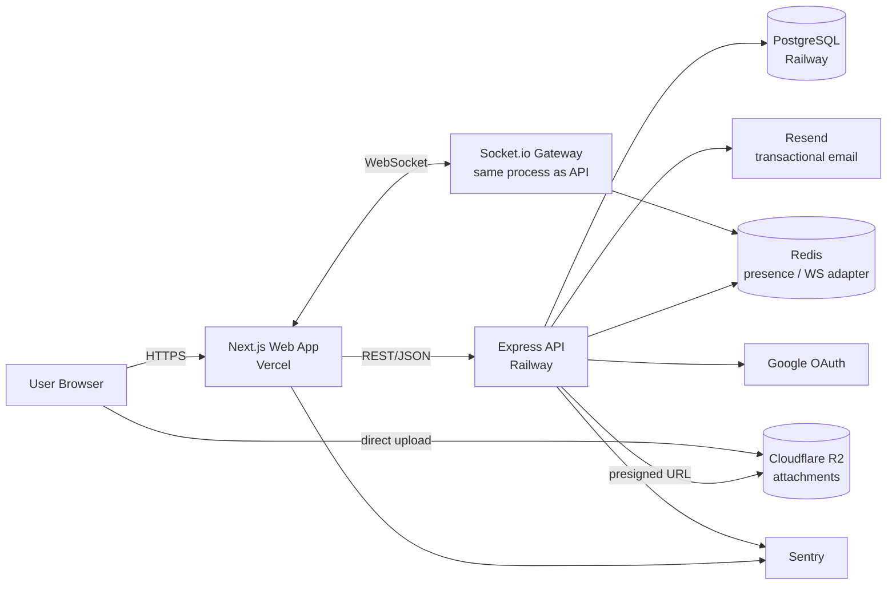
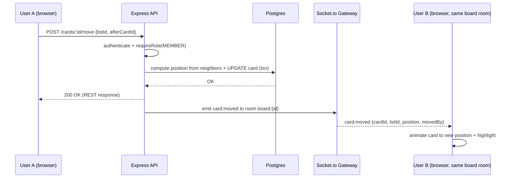
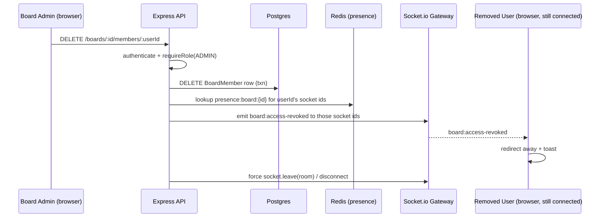

# Architecture Document

**Project:** ToDoApp_demo — Trello-style Collaborative Task Board
**Status:** Draft v0.3 — v0.2 addressed findings C1, H1–H5, M1–M5, L1–L3; v0.3 closes 3 items surfaced during recheck (ActivityLog cascade, jobs/ execution clarity, Owner-removal edge case) — see [Implementation-Readiness-Report.md](./Implementation-Readiness-Report.md)
**Author:** Winston (BMAD Architect Agent) with Gokayesen
**Date:** 2026-07-17
**Input:** [PRD.md](./PRD.md), [UX-Design.md](./UX-Design.md)
**Methodology:** BMAD-METHOD v6 — Phase 3 (Solutioning)

---

## 1. Architecture Principles

1. **Server is the source of truth, always.** All permission checks, reordering math, and business rules are enforced in the API layer — the client is optimistic UI only, never trusted (NFR3).
2. **One real-time backbone, not two sources of state.** REST for command/query, WebSocket for fan-out of the *same* state changes — no separate polling path to keep in sync.
3. **Boring, provable technology.** Every choice below favors mature, widely-documented tools over novel ones — the differentiator this project sells is *execution*, not tool novelty (see PRD §2).
4. **Low-cost, low-ops footprint.** Solo developer, portfolio budget — managed PaaS over self-managed infrastructure wherever it doesn't compromise the real-time/showcase goals.
5. **Types flow end-to-end.** One shared schema layer (Zod) between frontend and backend eliminates an entire class of integration bugs and is itself a portfolio signal.

## 2. Technology Stack

| Layer | Choice | Rationale |
|---|---|---|
| Monorepo tooling | **pnpm workspaces + Turborepo** | Single repo for `web`, `api`, `shared` — one clone, one CI pipeline, shared types without publishing packages |
| Frontend | **Next.js 15 (App Router) + React + TypeScript** | Industry-standard React meta-framework; used here purely as a frontend (SSR for the dashboard/marketing-adjacent pages, CSR for the live board) |
| UI components | **shadcn/ui (Radix + Tailwind CSS)** | Matches UX spec §2 — accessible primitives, fully themeable, no runtime component library lock-in |
| State/data-fetching | **TanStack Query** for REST, thin **Socket.io client** hook layer for real-time patches into the same cache | Gives optimistic updates + rollback (UX §5) out of the box |
| Backend | **Node.js + Express + TypeScript** | Most widely recognized Node backend choice; simple layered architecture (routes → controllers → services → repositories) keeps the real complexity budget on the real-time/permissions work rather than framework ceremony |
| Real-time | **Socket.io** (WS with fallback) + **Redis adapter** (`@socket.io/redis-adapter`) | Room-per-board broadcast model; Redis adapter makes the WS layer horizontally scalable from day one (NFR5) even though v1 runs a single instance |
| Database | **PostgreSQL** | Relational integrity for a genuinely relational domain (memberships, roles, ordered lists) — transactional guarantees needed for NFR8 (atomic reorder) |
| ORM | **Prisma** | Type-safe queries generated from schema, first-class migrations, pairs cleanly with the TypeScript-everywhere approach |
| Auth | **Passport.js** (local strategy + `passport-google-oauth20`) + JWT access token (short-lived) & rotating refresh token in an HTTP-only cookie | Standard, well-audited Express auth pattern; server-side session state avoided in favor of stateless JWT for easy horizontal scaling |
| Validation | **Zod**, schemas defined once in `packages/shared`, imported by both `web` and `api` | Single source of truth for request/response shapes and form validation |
| File storage | **Cloudflare R2** (S3-compatible), direct-to-storage presigned uploads | Zero egress fees, generous free tier, avoids proxying large files through the API |
| Email | **Resend** + **React Email** for templates | Modern DX, generous free tier, templates written as React components — reuses frontend skillset |
| Caching / pub-sub / presence | **Redis** (Upstash free tier or Railway Redis) | Socket.io adapter, presence set per board, rate-limit counters |
| Testing | **Vitest** (unit, both apps), **Supertest** (API integration), **Playwright** (E2E — including a **two-browser-context real-time collaboration test**) | Directly demonstrates NFR9 |
| Observability | **Sentry** (frontend + backend), **pino** structured logging in the API | Minimum viable production observability (NFR10) |
| CI/CD | **GitHub Actions**: lint → typecheck → unit/integration tests → build, on every PR; deploy on merge to `main` | Standard, free for public/portfolio repos |
| Hosting | **Vercel** (web) + **Railway** (api + WebSocket + Postgres + Redis) | Matches "low-cost PaaS" decision; Railway keeps API, DB, and Redis co-located and simple to operate for a solo dev |

### Decision Records (key trade-offs)

- **Express over NestJS/Fastify:** NestJS's DI/Guards map elegantly onto RBAC but add a real learning-curve/velocity tax against a 40-FR scope; Fastify is comparable to Express in outcome. Express + a disciplined manual layering (documented in §5) gets the same architectural clarity without framework lock-in risk. *Revisit if the team scales beyond solo.*
- **Own Socket.io layer over managed real-time (Supabase/Pusher/Ably):** PRD Goal #2 explicitly wants real-time systems engineering to be visible in the portfolio artifact — a managed service would hide exactly the work being showcased.
- **Separate `api` service over Next.js API routes:** keeps the WebSocket server (which needs a long-lived process, not the serverless model Vercel applies to Next.js API routes) in its natural home, and produces a cleaner "frontend talks to a real API" story for reviewers.
- **Fractional-index positions over integer re-sequencing** for List/Card ordering (detailed in §4) — avoids O(n) row rewrites on every drag, which matters once realistic board sizes are tested for NFR1.

## 3. System Context



## 4. Data Model

```mermaid
erDiagram
    User ||--o{ WorkspaceMember : has
    User ||--o{ BoardMember : has
    User ||--o{ OAuthAccount : has
    Workspace ||--o{ WorkspaceMember : has
    Workspace ||--o{ Board : contains
    Board ||--o{ BoardMember : has
    Board ||--o{ List : contains
    Board ||--o{ Label : defines
    List ||--o{ Card : contains
    Card ||--o{ CardLabel : has
    Label ||--o{ CardLabel : applied_to
    Card ||--o{ CardAssignee : has
    User ||--o{ CardAssignee : assigned_to
    Card ||--o{ Checklist : has
    Checklist ||--o{ ChecklistItem : has
    Card ||--o{ Comment : has
    Card ||--o{ Attachment : has
    Card ||--o{ ActivityLog : logs
    User ||--o{ Notification : receives
    User ||--o{ RefreshToken : has
    User ||--o{ PasswordResetToken : has
    User ||--o{ NotificationPreference : configures
    Workspace ||--o{ WorkspaceInvite : has
    User ||--o{ WorkspaceInvite : sends

    User {
        uuid id PK
        string email
        string passwordHash "nullable if OAuth-only"
        string name
        string avatarUrl
        timestamp createdAt
    }
    Workspace {
        uuid id PK
        string name
        uuid ownerId FK
    }
    WorkspaceMember {
        uuid workspaceId FK
        uuid userId FK
        enum role "OWNER, MEMBER"
    }
    Board {
        uuid id PK
        uuid workspaceId FK
        string name
        string background
        bool isArchived
    }
    BoardMember {
        uuid boardId FK
        uuid userId FK
        enum role "ADMIN, MEMBER, VIEWER"
    }
    List {
        uuid id PK
        uuid boardId FK
        string name
        float position
        bool isArchived
    }
    Card {
        uuid id PK
        uuid listId FK
        string title
        text description
        float position
        date startDate
        date dueDate
        bool isArchived
    }
    Label {
        uuid id PK
        uuid boardId FK
        string name
        string color
    }
    Checklist {
        uuid id PK
        uuid cardId FK
        string title
        float position
    }
    ChecklistItem {
        uuid id PK
        uuid checklistId FK
        string text
        bool isChecked
        float position
    }
    Comment {
        uuid id PK
        uuid cardId FK
        uuid userId FK "nullable, SetNull on user deletion"
        string authorNameSnapshot "captured at creation, survives author deletion"
        text body
        timestamp createdAt
    }
    Attachment {
        uuid id PK
        uuid cardId FK
        uuid uploaderId FK "nullable, SetNull on user deletion"
        string uploaderNameSnapshot "captured at creation, survives uploader deletion"
        string fileUrl
        string fileName
        int fileSize
        string mimeType
    }
    ActivityLog {
        uuid id PK
        uuid boardId FK
        uuid cardId FK "nullable"
        uuid userId FK "nullable, SetNull on user deletion"
        string actorNameSnapshot "captured at creation, survives actor deletion"
        string type
        jsonb metadata
        timestamp createdAt
    }
    Notification {
        uuid id PK
        uuid userId FK
        string type
        jsonb payload
        bool isRead
        timestamp createdAt
    }
    RefreshToken {
        uuid id PK
        uuid userId FK
        string tokenHash
        uuid familyId
        timestamp expiresAt
        timestamp revokedAt "nullable"
        timestamp createdAt
    }
    PasswordResetToken {
        uuid id PK
        uuid userId FK
        string tokenHash
        timestamp expiresAt
        timestamp usedAt "nullable, single-use marker"
    }
    NotificationPreference {
        uuid id PK
        uuid userId FK
        string eventType
        bool emailEnabled
        bool inAppEnabled
    }
    WorkspaceInvite {
        uuid id PK
        uuid workspaceId FK
        string email
        uuid invitedByUserId FK
        string tokenHash
        timestamp expiresAt
        timestamp acceptedAt "nullable, single-use marker"
    }
```



**Workspace invites (Story 2.3, FR7):** only the Workspace Owner can invite, by email. If the email already belongs to a `User`, a `WorkspaceMember` row (`MEMBER`) is created immediately — there is nothing left "pending" once the account exists. If it doesn't, a `WorkspaceInvite` row is created (`tokenHash`/`expiresAt` follow the same pattern as `PasswordResetToken`, 7-day TTL) and an email is sent with a registration link; the invite auto-resolves into a `WorkspaceMember` row the moment that email completes registration (password or Google), setting `acceptedAt`. No separate accept-invite endpoint exists — resolution is implicit in the registration flow. `WorkspaceInvite` cascades on `Workspace` delete and on the inviter's `User` delete (`onDelete: Cascade` for both), matching the compositional-data row in the cascade table below.

**Ordering strategy (Lists & Cards):** `position` is a float, but it is **always computed server-side, inside the same transaction as the write** — the client never submits a raw position value. The move/reorder endpoints accept a target-neighbor intent (`afterCardId` / `beforeCardId`, nullable for start/end-of-list), and the server re-reads those neighbors' current `position` values at write time and sets `position = (prev + next) / 2` (fractional indexing, same technique used by Figma/Linear) before committing. This closes the concurrency gap where two clients could otherwise compute overlapping positions from stale neighbor data. A background job rebalances positions for a list only if float precision is exhausted (practically never at portfolio-scale data volumes; see job execution strategy in §9). This keeps every drag-and-drop move an **O(1) single-row write** wrapped in a DB transaction with the moved row's board/list foreign keys re-validated — satisfying NFR1 (latency) and NFR8 (atomicity/no lost cards) together.

### Referential Integrity & Cascade Strategy

| Relationship | `onDelete` behavior | Rationale |
|---|---|---|
| `WorkspaceMember`, `BoardMember`, `CardAssignee` → `User` | **Cascade** | Pure membership rows; no reason to keep them once the user is gone |
| `RefreshToken`, `PasswordResetToken`, `NotificationPreference` → `User` | **Cascade** | Purely personal, never shared with other users |
| `WorkspaceInvite` → `Workspace`, `WorkspaceInvite.invitedByUserId` → `User` | **Cascade** | An invite has no meaning once its Workspace is gone, or once the inviter's account is gone |
| `Comment.userId`, `Attachment.uploaderId`, `ActivityLog.userId` → `User` | **SetNull** (FK nullable) + denormalized name snapshot captured at creation time | Preserves shared board history — including the audit trail itself — for teammates even after the author/actor deletes their account (PRD FR40). Without this, account deletion would fail with an FK constraint error for virtually every real user, since almost any board action writes an `ActivityLog` row |
| `Board`, `List`, `Card`, `Label`, `Checklist`, `ChecklistItem` → parent (`Workspace`/`Board`/`List`/`Card`) | **Cascade** | Compositional data — e.g. a Card's Checklist has no meaning without the Card |
| `Workspace.ownerId` → `User` | **Restrict** | Deleting the last owner of a Workspace with other members must force an explicit ownership-transfer step first, not silently cascade or orphan the Workspace |

This table governs both the Prisma schema (`onDelete` per relation) and Story 8.8 (Account Deletion), which must implement the ownership-transfer prompt for the `Restrict` case rather than letting deletion fail with a raw DB error.

## 5. Backend Layering

```
apps/api/src/
├── routes/         # thin HTTP route definitions
├── controllers/     # request/response shaping, calls services
├── services/         # business logic, permission checks, orchestration
├── repositories/       # Prisma queries, isolated from business logic
├── sockets/               # Socket.io gateway: connection, rooms, event handlers
├── middleware/               # auth, requireRole, rate-limit, error handler
└── jobs/                       # due-date reminder sweep, position rebalance (logic only)
```

`jobs/` holds job **logic** only — per §9, the due-date sweep and position-rebalance jobs execute via a separate scheduled entrypoint (or an in-process scheduler gated behind a Redis leader lock), never as an unconditional part of the main long-lived request-handling process.

Every mutating route follows the same chain: `authenticate → loadResourceContext (board/card) → requireRole(minRole) → controller → service`. `requireRole` is the single enforcement point for the RBAC model in PRD §5 — permissions are never re-implemented ad hoc per route.

## 6. Real-Time Architecture

- **Authentication (handshake):** the client connects with `io(WS_URL, { auth: { token: accessToken } })`; a Socket.IO connection middleware verifies the JWT access token before the connection is accepted (mirrors the REST `authenticate` middleware, same verification logic) and attaches `socket.data.userId`. Unauthenticated or expired-token connections are rejected at handshake, before any `board:join` is possible.
- **Reconnection on token expiry:** when the access token expires mid-session, the client silently refreshes it via the REST refresh flow (§7.2) and reconnects the socket with the new token; the client-side socket hook treats this the same as a network blip (brief "reconnecting…" presence state, no user-visible disruption).
- **Rooms:** on opening a Board, the client emits `board:join`; the server joins the socket to room `board:{boardId}` after re-validating the user's effective BoardMember role server-side per §7.4 (never trust a client-supplied board ID without an auth check).
- **Presence:** each room join writes the user to a Redis set `presence:board:{boardId}` with a TTL-refreshed heartbeat; on join/leave/disconnect the server broadcasts `presence:update` with the current member list — this drives UX §6's live avatar stack. This same presence set is what the membership-change eviction below uses to locate a user's active connections.
- **Event catalog** (server → room broadcast, after the triggering REST mutation commits):
  `card:created`, `card:updated`, `card:moved`, `card:deleted`, `list:created`, `list:updated`, `list:moved`, `list:deleted`, `label:changed`, `comment:created`, `member:added`, `member:removed`, `checklist:updated`, `board:access-revoked`
- **Write path is REST, not socket:** clients call REST endpoints to mutate; the API commits to Postgres, then emits the corresponding socket event to the room. This keeps a single, testable write path (no divergent logic between HTTP and socket handlers) while still delivering sub-second fan-out (NFR2).
- **Concurrent edit signal:** each mutation carries the previous `updatedAt`/version; if a client's local optimistic state is older than an incoming broadcast for the same entity, the UI shows the "just updated by X" notice from UX §6 instead of silently overwriting.
- **Membership-change eviction:** when the Board-membership service (Story 2.6) removes a member or downgrades their role, it looks up that `userId`'s active connections via the `presence:board:{boardId}` Redis set, emits `board:access-revoked` directly to those socket IDs, then force-calls `socket.leave(room)` (fully disconnecting if the user lost all access, not just a role downgrade). The client handles `board:access-revoked` by redirecting away from the board with an explanatory toast (UX §6) — a removed member cannot keep receiving live updates simply because their tab stayed open.





## 7. Auth & Permission Flow

### 7.1 Cross-Origin Session Strategy (web on Vercel, api on Railway)

`web` and `api` sit on different origins, which has direct consequences for cookie-based session handling:

- **v1 default (no custom domain required):** the refresh cookie is set with `SameSite=None; Secure; HttpOnly`, and the API's CORS configuration sets `credentials: true` with an explicit `Access-Control-Allow-Origin` matching the deployed Vercel URL (never a wildcard — wildcard origins are incompatible with credentialed requests). The web app calls the API with `fetch(..., { credentials: 'include' })`.
- **Recommended production hardening:** move `web` and `api` under one apex domain as subdomains (e.g., `app.yourdomain.com` + `api.yourdomain.com`). This allows reverting to the simpler/stricter `SameSite=Lax`, and avoids Safari/iOS ITP's third-party-cookie restrictions, which can still intermittently affect a `SameSite=None` cookie on a fully different registrable domain. Treat this as a low-cost (~$10–15/year domain) upgrade once the app is otherwise stable — not a blocker for initial development.
- The Socket.IO handshake (§6) is unaffected by this cookie question since it authenticates via an explicitly-passed access token, not a cookie.

### 7.2 Access & Refresh Tokens

1. **Email/password:** register hashes password with **argon2**; login issues a short-lived **JWT access token (15 min)**, held client-side in memory only (never in `localStorage`, to limit XSS exposure), plus a **refresh token** per §7.1's cookie strategy.
2. **Refresh token rotation & reuse detection:** each refresh token corresponds to a `RefreshToken` row (`tokenHash`, `familyId`, `expiresAt`, `revokedAt` — see §4). On every `/auth/refresh` call: verify the presented token's hash against an unrevoked, unexpired row; issue a new access token **and** a new refresh token in the same `familyId`, then revoke the presented row. If a token is presented that is already revoked (i.e., reuse of a token already rotated away), treat it as a stolen-token signal: **revoke the entire token family** and require full re-authentication. This is what makes "rotating" refresh tokens an actual security property rather than a label.
3. **Socket.IO auth** uses the same access token via the handshake `auth` payload (§6) — no separate token type.

### 7.3 Google OAuth Account Linking

Passport's Google strategy handles the OAuth flow. On callback:
- If an `OAuthAccount` already exists for this `(provider, providerAccountId)`, log in as its linked `User`.
- Else if Google reports `email_verified: true` and a `User` already exists with that email, **link** a new `OAuthAccount` to that existing `User` (do not create a duplicate `User`). This is gated strictly on `email_verified` to avoid an account-takeover vector via an unverified email claim.
- Else, create a new `User` + linked `OAuthAccount` (first-time signup via Google).

### 7.4 Authorization (RBAC)

Every request carries the access token; `authenticate` middleware verifies and attaches `req.user`. Resource-scoped middleware (`loadResourceContext`) then determines the **effective role** as follows — this is the single RBAC choke point referenced in §5:

1. If the user has a `WorkspaceMember` row with `role = OWNER` on the Workspace that owns the target Board, they are treated as **Board Admin** on every Board in that Workspace, even without an explicit `BoardMember` row (resolves PRD §5's "Owner can do everything an Admin can" guarantee explicitly and mechanically, rather than leaving it implicit).
2. Otherwise, the user's effective role is whatever their explicit `BoardMember` row says (Admin/Member/Viewer).
3. No `BoardMember` row and not a Workspace Owner → 403.

`requireRole(minRole)` compares the effective role from steps 1–2 against the route's declared minimum — permissions are never re-implemented ad hoc per route.

Because Owner access in step 1 is **derived, not stored**, the Board-member-removal endpoint (Story 2.6) must explicitly reject attempts to remove or downgrade a Workspace Owner from a Board they only have implicit access to (`400` — "Workspace Owners can't be removed from a Board directly; remove them from the Workspace instead"), rather than silently no-op-ing on a missing `BoardMember` row or leaving the removal seemingly-successful-but-ineffective.

### 7.5 Password Reset

Time-boxed, single-use token: a `PasswordResetToken` row (`tokenHash`, `expiresAt`, `usedAt` — see §4) is created and the raw token emailed via Resend. `usedAt` is set on redemption and checked on every attempt, so a captured reset link cannot be replayed even within its expiry window.

## 8. Non-Functional Requirement Traceability

| NFR | Architectural mechanism |
|---|---|
| NFR1 (latency) | O(1) reorder writes, TanStack Query cache + optimistic updates, Vercel edge network for static/SSR assets |
| NFR2 (real-time <1s) | Socket.io room broadcast immediately after DB commit; Redis adapter avoids cross-instance delivery gaps |
| NFR3 (security) | argon2 hashing, HTTPS everywhere, server-side RBAC choke point (§7.4), Zod input validation on every route, Redis-backed rate limiting (`rate-limit-redis`) on `/auth/*` so limits hold across horizontally scaled instances, refresh-token rotation with reuse detection (§7.2) |
| NFR4 (99% uptime) | Railway + Vercel managed platforms with health checks/auto-restart |
| NFR5 (scalability) | Stateless API processes + Redis-backed Socket.io adapter; Redis-backed rate limiting (not in-memory); scheduled jobs run via a single leader-elected instance or a separate cron service (§9), not per-instance — all three needed together for horizontal scaling to actually be safe, not just the socket layer |
| NFR6 (accessibility) | shadcn/ui + Radix primitives (UX §8), keyboard DnD alternative specified in UX §5 |
| NFR7 (browser support) | Next.js + evergreen browser target, no legacy polyfill budget needed |
| NFR8 (data integrity) | Fractional-index positions written inside DB transactions, FK constraints enforced by Postgres |
| NFR9 (test coverage) | Vitest unit + Supertest integration in CI; Playwright E2E includes a dual-browser-context real-time test |
| NFR10 (observability) | Sentry (both apps) + pino structured logs in API |

## 9. Deployment Topology

- **`web`** → Vercel, auto-deploy from `main`, preview deployments per PR.
- **`api`** (Express + Socket.io) → Railway service, auto-deploy from `main`.
- **Domain strategy:** v1 runs on default `*.vercel.app` / `*.up.railway.app` domains with the cross-origin cookie handling from §7.1. Custom-domain unification (`app.` / `api.` subdomains) is a documented, low-cost upgrade path, not a v1 blocker.
- **Postgres** + **Redis** → Railway managed add-ons in the same project (private network to `api`, no public exposure).
- **R2** bucket → Cloudflare, accessed via presigned URLs only (no public bucket listing); bucket CORS policy explicitly allow-lists the deployed `web` origin(s) for direct browser `PUT` uploads.
- **Scheduled jobs** (due-date sweep, position rebalance): run as a **separate Railway cron-triggered service** (not in the same long-running process as the API), so they execute exactly once regardless of how many `api` instances are running. If a separate service isn't warranted yet, the in-process fallback must acquire a Redis `SETNX` leader lock before running — never fire unconditionally per-instance.
- **Environments:** `local` (docker-compose for Postgres/Redis), `preview` (per-PR, seeded demo data), `production` (seeded demo workspace for reviewers, per PRD §10 success metric).
- **Secrets:** managed via each platform's environment variable store; never committed. `.env.example` documents required variables.

## 10. Open Technical Risks

| Risk | Mitigation |
|---|---|
| Socket.io + Railway cold-start/proxy WebSocket support | Verify Railway's WebSocket proxy behavior early (spike in Epic 1) before committing further |
| Cross-board card drag-and-drop (PRD FR20, flagged stretch) | Data model already supports it (`listId` FK reassignment); defer implementation decision to Epic 3 story sizing |
| Fractional position float exhaustion at extreme reorder counts | Rebalance job in `jobs/`, not expected to trigger at demo data volumes — documented, not blocking |
| Solo-dev timeline vs. 40 FRs + real-time depth | Epic sequencing should sequence Epic 5 (real-time) early enough that it isn't compressed if time runs short, since it's the showcase differentiator |
| Safari/iOS ITP intermittently restricting the `SameSite=None` cross-origin refresh cookie (§7.1 v1 default) | Acceptable residual risk for a portfolio demo; the documented custom-domain upgrade path removes it entirely if it becomes a real issue |
| Ownership-transfer UX for the `Workspace.ownerId` `Restrict`-delete case (§4 cascade table) not yet designed | Small UX addition needed within Story 8.8's scope — flag for a UX pass, not architecturally blocking |

## 11. Next Steps (BMAD Flow)

1. **Create Epics & Stories** (`bmad-create-epics-and-stories`) — break the PRD §11 epic list into implementable stories against this architecture (data model, endpoints, and socket events above give story authors concrete acceptance-criteria material).
2. **Implementation Readiness Check** — verify PRD, UX, and this Architecture stay consistent before Sprint Planning.
3. **Sprint Planning** → story-by-story development, starting with Epic 1 (Foundation & Auth) including the Railway WebSocket spike called out in §10.

---
*This architecture was produced via BMAD-coached discovery. Revisit via the `bmad-architecture` update workflow if a decision in §2 needs to change.*
